In this project, I explored the ability of convolutional neural networks to extract features from spectrograms of songs. I trained a model on these features to perform classification of their respective genres. 

## Project Motivation
---

The feeling that we get when we listen to music - the very sound waves that vibrate our ear drums and fire up our brains in response - is as subjective as it gets. There are no two ways about it: one person might enjoy the soft and ethereal tunes of dream pop, while another would enjoy the intensity and power of industrial metal. Generally, _people tend to stick with and listen to just a few musical genres that they favour or have an affinity with_, be it pop, rock, jazz, or classical music, to name a few. 

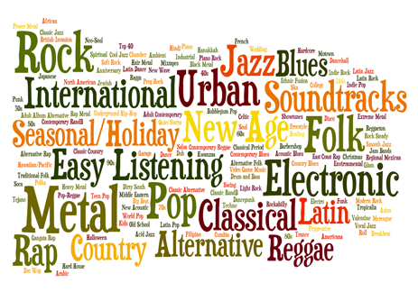
<sub>*Does Urban sound like cars and air conditioning units?*</sub>

What defines a music genre? Does the answer lie in the instruments that play in the song? Is it defined by the speed in which the music plays? Or is it the message that the singer is trying to get across? Maybe, it is a combination of all of those elements, underpinned by an unspoken rule that permeates through everybody's consciousness? Without any information - the title of the song, the artist's name, the date the song was released - a person would easily be able to identify the genre of a song in a few seconds to a high degree of accuracy.

This brings me to my project. __What I am trying to do in this project is to develop a model to perform accurate classification of music genres to a high degree of accuracy. The only data that will be available to the model is the raw audio file itself - no metadata or other information will be given other than the actual audio for classification.__

#### Why is this important?

Parties that would benefit most from robust models to extract audio information is are music companies like Spotify, SoundCloud, or Apple. For example, Spotify receives [thousands](https://expandedramblings.com/index.php/spotify-statistics/) of new tracks a day, and having a model to extract audio features from the tracks would be invaluable for classification. In particular, their playlist generation and music recommendation system benefits from augmenting a traditional [collaborative filtering](https://en.wikipedia.org/wiki/Collaborative_filtering) based recommender with content-based recommenders to aid with the [cold start problem](https://en.wikipedia.org/wiki/Cold_start) for new tracks that are recently uploaded. 

Aside from the music industry, there could be significant benefits to be had with other industries. With this, it is possible that any audio could potentially be run through a similar model, and important features could be extracted and analysed or classified. 


## Pre-Processing
---

The audio files and related metadata are sourced from the Free Music Archive (FMA) Database, which contains a 900+ GiB library of 106,574 tracks of creative Commons-licensed audio from 16,341 artists and 14,854 albums, arranged in a hierarchical taxonomy of 161 genres. For this project, I decided to only utilize a fraction of the dataset. This fraction - found as 'fma_small' in the repository - consists of 8000 tracks of 30s each, with 8 balanced genre classes. This was useful as I would not have to worry about an unbalanced dataset. 

The 8 genre classes are:
* Electronic
* Experimental
* Folk
* Hip-Hop
* Instrumental
* International
* Pop
* Rock


The mel-spectrograms were created from the audio files themselves, and the class labels to be trained on are the 8 respective genres associated with the audio file.

### Mel-Spectrograms


#### Spectrograms
A spectrogram is a visual representation of the spectrum of frequencies of sound (on the y-axis) as they vary with time (on the x-axis).

The spectrogram is computed by performing a [Fast Fourier Transform](https://en.wikipedia.org/wiki/Fast_Fourier_transform) on the floating point time-series of an audio file. This performs a dimensionality reduction on the time series and processes the audio signal in the frequency domain, which allows for much better analysis on the audio file.

#### Why use the Mel-scale?

Typically, a spectrogram would use linear scaling on the frequency domain. This does not really model a human's perception of sound, which does not perceive frequencies on the linear scale. Our auditory system is more discriminative at lower frequencies and less discriminative at higher frequencies.
For example - we would not perceive the 'distance' between a _100hz_ (__G2__ in [scientific pitch notation]( https://en.wikipedia.org/wiki/Scientific_pitch_notation)) and _200hz_ (__G3__) sound wave to be the same as the distance between a _900hz_ (__A5__) and _1000hz_ (__B5__) sine wave. 

You can try it out for yourself [here](http://www.szynalski.com/tone-generator/).

So, how can we scale the frequency domain to match it better to our own perception of sound? A [Mel scale](https://en.wikipedia.org/wiki/Mel_scale) can be used for mapping on the frequency domain instead. It is a scale which utilises a quasi-logarithmic spacing to roughly resemble the way our auditory system resolves and perceives sound. This is important in the context of speech and music audio analysis, as these sounds are made for our own auditory system to perceive, and we want the analysis to be conducted on our own (_biased_) perception of sound.

Therefore, for the spectrograms that were created, a mel scale is used to scale the frequency domains.

Example code for generating mel-spectrograms on python (found on my repository in this [notebook](https://github.com/melvinperera/Music-Genre-Analysis/blob/master/Notebooks/extractingfeatures.ipynb) on cell 19):
```python
scaler = MinMaxScaler()   # to be used to scale between values between 0 and 1

for folder in os.listdir('fma_small'):
    if folder.startswith(('0','1')):
        for filename in os.listdir('fma_small/'+ folder):
            if filename.endswith('.mp3'):   
                path = 'fma_small/' + folder + '/' + filename
                file, sr = lib.core.load(path)  # This loads the audio file (mp3 in this case) into a 
                                                # floating point time-series.
                    
                mel = lib.feature.melspectrogram(file, n_mels = 128)[:,:1024] # individual mel-spectrogram.
                mel = lib.power_to_db(mel, ref=np.max) # converting to db units
                melscaled = scaler.fit_transform(mel) # scaling
                x = np.array(melscaled)
                if x.shape == (128, 1024):            # enforcing dimensions
                    x.dump("pickles/{}.pickle".format(filename[:-4]))    # saving melspecs into a pickle.
```

These are the examples of the mel spectrograms extracted from the audio files:
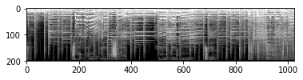

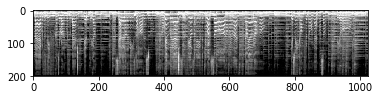


## Modelling
---

Now, I have the mel-spectrograms and the genres of each track labelled as their classes. So, how will the mel-spectrogram images be modelled to extract features and information out of them? In comes __Convolutional Neural Networks__.

### Convolutional Neural Networks

A thorough runthrough of convolutional neural networks and the theory behind it would be too dense to go through it here (And I would probably run out of space). Instead I will just do a brief summary and leave the more detailed explanations to the various hyperlinks embedded in the text.

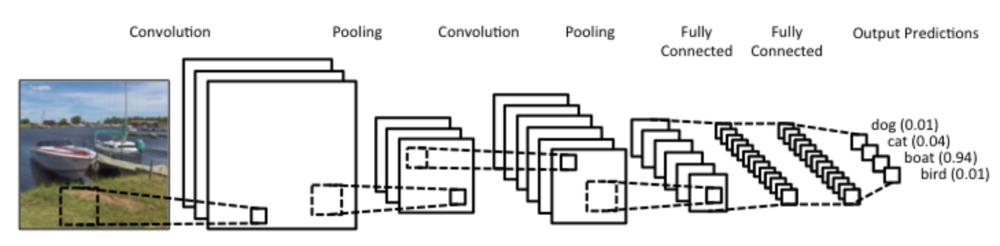
The image above gives a rough idea of how a convolutional neural network behaves. The first (and biggest) layer will scan through the image with many filters, and perform a dot product between each individual filter and the portion of the image that it is scanning. 

A [rectifier](https://en.wikipedia.org/wiki/Rectifier_(neural_networks)) is also usually applied to the dot product (eg: a ReLU unit) to ensure an efficient gradient propagation and prevent [vanishing/exploding gradients.](https://en.wikipedia.org/wiki/Vanishing_gradient_problem).

Afterwards, there is a [Pooling layer](https://en.wikipedia.org/wiki/Vanishing_gradient_problem) applied to reduce the dimensionality of the model and improve computing efficiency.

Example code of a convolutional layer on Keras adapted from my [model](https://github.com/melvinperera/Music-Genre-Analysis/blob/master/Models/convpool.py):

```python		
model.add(Convolution2D(32, kernel_size=4, strides=2, activation='relu', input_shape=self.input_shape))
model.add(BatchNormalization())
model.add(MaxPooling2D(pool_size=(2, 2), strides=(2, 2)))
```

This process is then iterated through multiple times to extract higher level features from the output of the previous convolutional layers. Dropouts are typically used in between layers too as a form of regularisation to prevent overfitting.

The final output of all the convolutional layers are then fed into a fully connected layer as features to be learned. In my case, I fed the convolutional features into a fully connected layer, and then into a final 8 neuron classifier with a [softmax](https://en.wikipedia.org/wiki/Softmax_function) function to calculated the predicted probabilities for each class. 

TL;DR -

>Basically, the convolving filters are able to extract information from the spectrograms and convert these information into features for a classifier to work on. The classifier (which is a fully connected layer with a classification layer of 8 classes) would then map these features into 8 classes, namely the music genres of each audio file.


### Training the Model

Now that we (_kind of_) know how Convolutional Neural Networks work, I will talk about my processes of training this model. 

I used the powerful ```Keras``` package using ```Tensorflow``` as a backend. My reason for choosing ```Keras``` was the high level nature of the package and the ease in which layers could be created, which was perfect for learning about Convolutional Neural Networks as a beginner. Using ```Tensorflow``` would not lead to such a smooth experience, but it would definitely be useful as there is much more customisability and control that could be exerted on the layers which would work better for a non-beginner to play around with. 

After [creating](http://localhost:8889/notebooks/Music-Genre-Analysis/Notebooks/convpoolnoaug.ipynb) a simple convolutional network (convnet) with 2 layers followed by a fully connected (fc) layer and a softmax classifier, I was excited to start training the model. Time to go! 

__DISASTER.__

2 problems:
* The size of the audio files were big. 
* My machine (a 2012 MacBook Pro) cannot run ```tensorflow-gpu``` as there is an incompatibility with OSX (WHY).

My machine refused to run the model and train it. So I had to resort to the power of __CLOUD COMPUTING.__


#### Cloud Computing

I've used AWS instances before and was more familiar with the AWS platform, so I was naturally inclined to use a virtual machine from them and train my model. However, renting a GPU instance would not be cheap and the price considerations of training the model had to be taken into account. Google Cloud was offering $300 in credit to new signups, and so I decided to sign up as a new user and start training the model. I rented an 8 core instance with 56GB (yes 56) of RAM with a Nvidia K80 GPU.

After setting everything up (and improving my bash programming skills tenfold) I managed to start training my models.

My dataset, which had 8000 samples, underwent a training/validation/test set split of ratios being 80/10/10.

### Results

#### First Model

The first model that I tried was a vanilla convolution-pool net with 4 convolutional layers with increasing filters ever layer to extract more higher-level features. I then attached a 1024-neuron fully connected layer and ended it off with a 8-neuron classification layer with a softmax activation to perform class predictions. The model can be found [here](https://github.com/melvinperera/Music-Genre-Analysis/blob/master/Models/convpool.py). Here are the results -

Single convpool with no augmentation (notebook found [here](https://github.com/melvinperera/Music-Genre-Analysis/blob/master/Notebooks/convpoolnoaug.ipynb)):
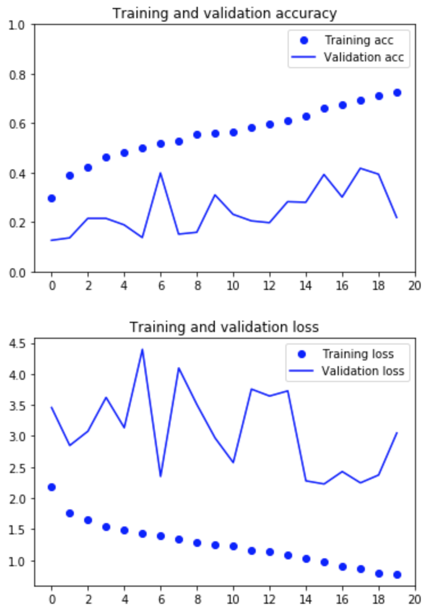

Although the training set accuracy and loss metrics were improving after every epoch, the validation set metrics were erratic and not really improving. Even with 20 epochs, it is already showing signs of overfitting as compared to the validation set. Data augmentation would definitely help here to increase the size of the training set.

#### Data Augmentation

Thanks to ```Keras```, performing data augmentation on images is fairly straightforward when using a flow generator. This is a very powerful tool to allow for data augmentation in the training set, where I can change the parameters of each image at will with the ImageDataGenerator method on ```Keras```. This also allows me to increase the training set size to as much as I wish, as the flow generator iterates through the training set infinitely until it is explicitly called to stop. 

There are many parameters that can be adjusted to augment the image to generate much more training set data. For my case in analyzing spectrograms, the only applicable data augmentation that can be done is the zoom_range parameter. Doing a rotation, shear, or flip would change the time-dependency on the X-axis of the spectrogram image. 

Code for performing data augmentation and to create a generator object to feed into the ```fit_generator``` method on the ```Keras``` model. Note that I do not perform data augmentation for the validation set, as only the raw images would be used for testing.
```python
from keras.preprocessing.image import ImageDataGenerator

train_datagen = ImageDataGenerator(
      rescale=1./255,
      rotation_range=0.,
      width_shift_range=0.,
      height_shift_range=0.,
      shear_range=0.,
      zoom_range=0.,
      horizontal_flip=False,
      fill_mode='nearest')

test_datagen = ImageDataGenerator(rescale=1./255)

train_generator = train_datagen.flow_from_directory('dataset/', target_size = (200,1024), batch_size = 20, class_mode = 'categorical')

validation_generator = test_datagen.flow_from_directory('validation/', target_size = (200,1024), batch_size =20, class_mode = 'categorical')
```

#### Second Model

With the same architecture, I decided to just change the ```zoom_range``` by 0.3 to analyse the finer features of the spectrograms better and to further generalize the training set to prevent overfitting. This were the results:


Single convpool with augmentation (notebook found [here](https://github.com/melvinperera/Music-Genre-Analysis/blob/master/Notebooks/convpoolnoaug.ipynb)):
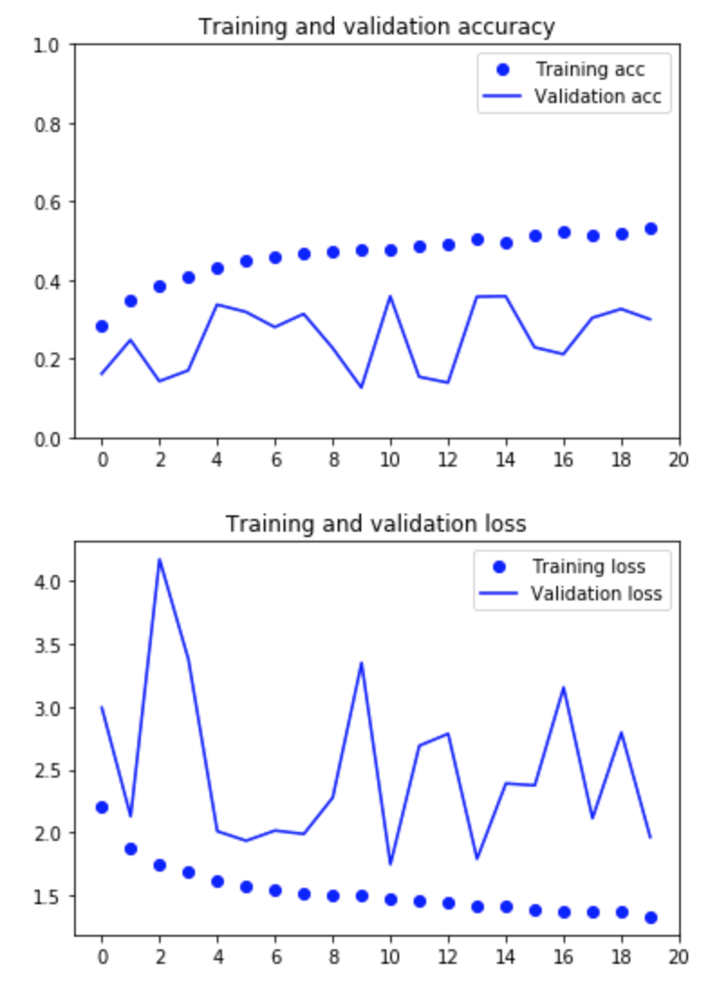

Data Augmentation definitely helps in preventing the training set from overfitting so quickly. However, the accuracy gains are not good and the validation set doesn't seem to be getting better over the epochs. There is a huge variation in validation loss and accuracy as well. Perhaps a better architecture that would detect more granular features is needed.

#### Third Model

 I decided to train this new architecture (model found [here](https://github.com/melvinperera/Music-Genre-Analysis/blob/master/Models/convconvpool.py)) on an architecture with 2 convolutional layers, followed by a Batch-Norm layer and a pooling layer, and repeated twice. This would improve the granularity of the features detected by the convolutional network and help to identify finer features in the spectrogram.

Double convpool with no augmentation (notebook found [here](https://github.com/melvinperera/Music-Genre-Analysis/blob/master/Notebooks/convconvpoolnoaug.ipynb)):
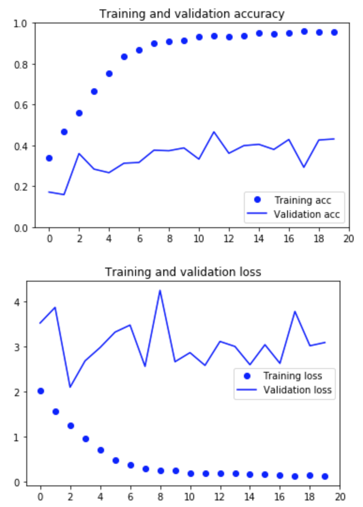

Although this model fits very quickly with no data augmentation on the training set, it still overfits with the training set against the validation set. Augmentation on the training set data will help here.

#### Fourth Model

I performed the same augmentation (```zoom_range``` of 0.3) of the trainings set data and ran it for 80 epochs (took 4.77hours to train!) to maximise accuracy gains. I also increased the training set size from 6394 samples to 10000 samples.

Double convpool with augmentation and run for 80 epochs (notebook found [here](https://github.com/melvinperera/Music-Genre-Analysis/blob/master/Notebooks/convconvpoolwithaug_80epochs.ipynb)):
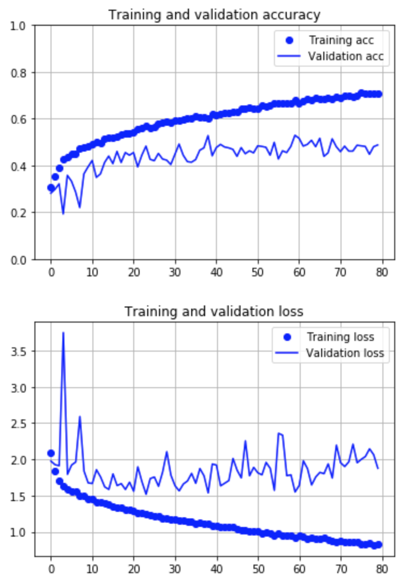

This looks better. The model isn't overfitting as much anymore. However the accuracy of the validation set is only about 0.47 and doesn't seem to be improving with an increasing amount of epochs. The validation set loss is also quite erratic and skips about a fair bit. Let me try a new architecture. 

#### Transfer Learning using ResNet50

I decided to improve on the complexity of the convolutional model to train on the spectrogram dataset. I used a ResNet50 model as described in [this](https://arxiv.org/abs/1512.03385) paper.

#### ResNet50 architecture
Typically, by stacking more convolutional layers on top of each other, the convolving filters will learn deeper representations of the image and extract more abstracted and refined features of the image. However, the vanishing/exploding gradient problem is a notorious issue that plagued deep networks due to the backpropagation of the gradients through more and more layers. This problem is largely solved now by using normalised initialisations and adding more normalisation layers, which are typically done with almost all deep convolutional models now.

The issue that rose from training deeper networks was a degradation problem: with increasing network depth, the accuracy of the model saturates, and then degrades rapidly. The natural conclusion is that the model is overfitting - but it was shown to not be that case as the accuracy was degrading on the training set! The problem lies in identity mapping - convolutional layers are worse at learning identity mapping of abstracted features than the original mapping. This is what the ResNet architecture hopes to solve - by using a Residual learning framework that learns the residual mapping from the layer input rather than the output.

This is what a Residual layer looks like. Notice how the output of the layer is mapped from the input of the previous layer, and not from its direct predecessor. The 'shortcut connection' helps to perform more accurate identity mapping than with traditional deep convolutional layers.


The ResNet50 architecture utilises a very deep convolutional network of __50__ such residual layers which would result in a very deep architecture that would be able to learn high level representations of filters. This ResNet50 model that I have imported from ```keras.applications``` comes pretrained with weights learned from the [Imagenet database](http://www.image-net.org/) with over 14 million images. I unfroze the top 8 layers of the network and let my gradients backpropagate through them, in an attempt to fine-tune the model to learn better representations of the spectrogram images (which admittedly look very different from normal images). The full ResNet50 architecture is in the ```models``` folder in my github repository.

I then attached a 1024-neuron fully connected layer and ended it off with a 8-neuron classification layer with a softmax activation to perform class predictions. Code for the model is found [here](https://github.com/melvinperera/Music-Genre-Analysis/blob/master/Models/resnet.py)

#### Why use Transfer Learning?

From Andrew Ng, the machine learning guru himself - _"Transfer learning will be next driver of machine learning success."_

By using a very deep pre-trained ResNet model that has its weight trained on a large database, I am able to utilise deep convolutional nets without having a large dataset. Also, this saves a significant amount of computational power by freezing layers and essentially 20 million parameters in place, which would represent low level representations of features anyway.


Resnet model (notebook found [here](https://github.com/melvinperera/Music-Genre-Analysis/blob/master/Notebooks/resnet-batch50.ipynb)):
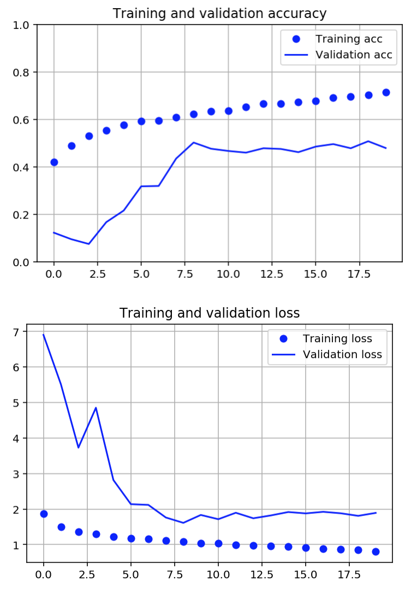

It can be seen here that the model performs better than the previous architectures in the same number of epochs. There aren't many fluctuations in the loss and accuracy of validation set. The loss and accuracy of the validation set seemed to plateau at about 1.9 and 48% respectively, and I decided to stop my training there before it overfits on the training set.

Although it was almost 4x more accurate than the baseline (a random guess), I wasn't very happy with the 48% accuracy on the validation set. Of course, unfreezing more layers of the ResNet model would probably result in some accuracy gains, but the model is already computationally expensive as is. I will run this model to predict classes in the test set and see what I can observe and analyse from it.

## Evaluation of the Test Set
---


The test set contains 8 balanced classes of 100 samples each. This was the classification report after running the test set through the model and getting the class predictions:

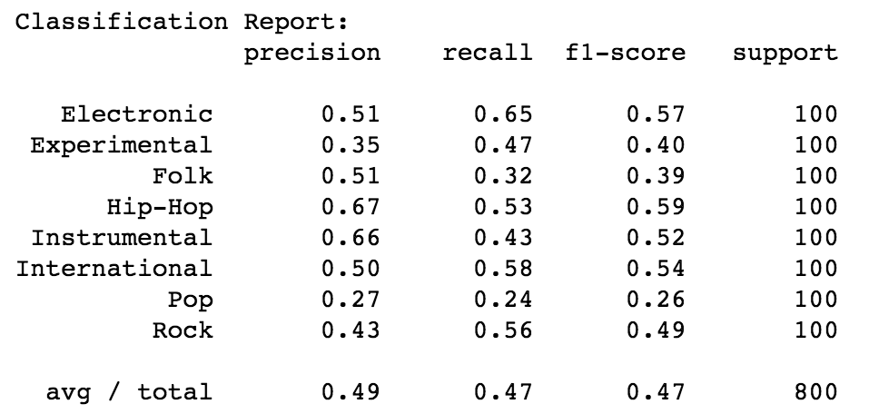

Pop, Folk, and Experimental Music didn't fair too well, (f1-scores below 0.4) but the rest of the genres did better with f1-scores above 0.5. In particular, Hip-Hop Music had a high precision of 0.67, which means that there weren't many false prediction of Hip-Hop music. 

#### Rock Music misclassification analysis

I will analyse Rock Music first and see what misclassifications were there. I created a dataframe of misclassified predictions where I identified the track to be a Rock song but the actual label is different, sorted by decreasing prediction probability.

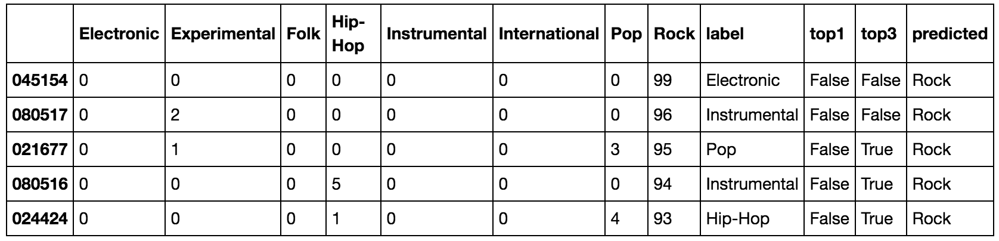

In this dataframe, the index represents the track id. The columns from 'Electronic' to 'Rock' represent the prediction strength of the respective genre from a scale of 0 to 100. The column 'label' is the true label of the track. The column 'top1' and 'top3' are boolean columns that states whether the true label is in the top 1 or top 3 class predictions. The last column 'predicted' is the top class prediction from the model.

Hear the tracks here:

<iframe width="100%" height="300" scrolling="no" frameborder="no" src="https://w.soundcloud.com/player/?url=https%3A//api.soundcloud.com/playlists/381734963&amp;color=%23ff5500&amp;auto_play=false&amp;hide_related=false&amp;show_comments=true&amp;show_user=true&amp;show_reposts=false&amp;show_teaser=true&amp;visual=true"></iframe>


Granted, upon listening to these tracks, 045154 seems to be a misclassified song. I could still see how it could be mistaken for a rock song, but I think it is just my bias talking here.

Track 021677 is a bit ambiguous. Definitely in the grey area but the second highest prediction for the classifier was Pop. At least it's in the top 3.

Same for track 024424. Top 3 is alright. I could definitely hear some rock elements.

Tracks 080517 and 080516 are interesting though. Listening to it, I would say that it definitely is a rock song without a doubt. Something is working well for my classifier. Maybe my low accuracy rate is because of 'mislabelling'? 

#### Analysis of International Songs

Let's look at international songs. I am quite curious as to what 'constitutes' an International song and what the diference between them and other genres could be. Let's see:

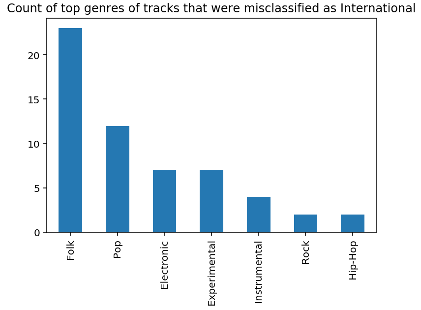
Apparently most Folk songs are being misclassified as International songs. Interesting... Let's look at the inverse: the top genres of tracks that are misclassified as Folk.

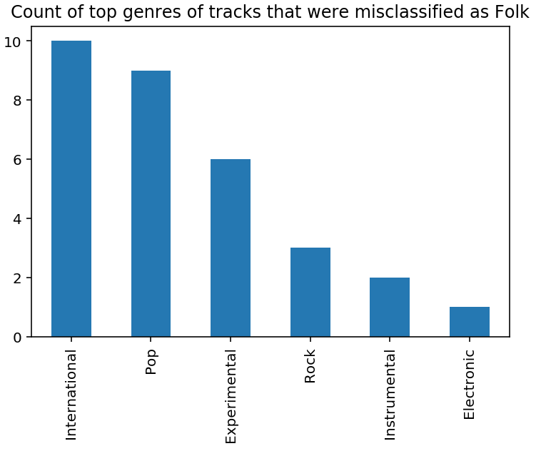

International and Pop songs are being misclassified as Folk songs. There should be some relation between them. Interestingly, no Hip-Hop songs were misclassified as Folk. Makes sense...

#### Analysis of Pop Songs

Let's take a look at why Pop songs perform so poorly:

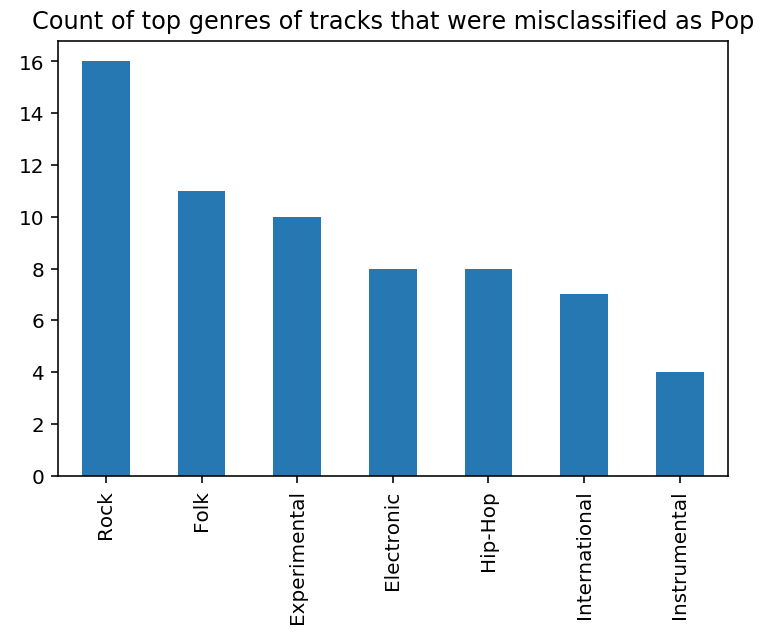
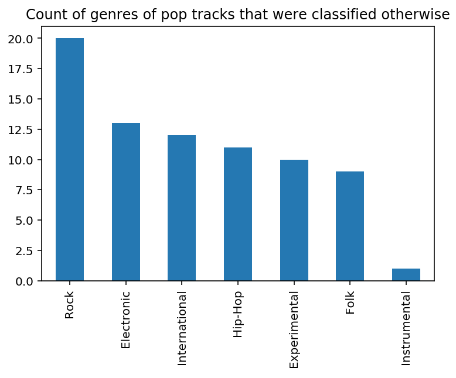


It seems that instrumental songs are rarely ever considered pop songs, but the distribution looks similar for the rest of the genres (barring Rock songs). This implies that the pop genre is more of a meta-genre than other genres, borrowing elements from every other genre. Compare these plots with the plots of the International/Folk songs - the difference is definitely discernable.


## Applications to the Beatles
---

I decided to mess around with my Beatles discography to see what I can uncover from this model. I sliced each audio file into separate spectrograms, with an average of 23.78s of music per slice. I ran it through my pretrained convnet with the finetuned
ResNet50 architecture, and found the mean for the classifiers for each softmax classifier to get the classification for each track.

You can find the notebook [here](https://github.com/melvinperera/Music-Genre-Analysis/blob/master/Notebooks/Beatles.ipynb).

With that, I managed to get a 8-dimensional matrix of class predictions. In order to visualise these predictions, I 
I decided to use the [T-distributed Stochastic Neighbour Embedding](http://scikit-learn.org/stable/modules/generated/sklearn.manifold.TSNE.html) on ```sklearn``` to reduce the dimensionality of the data to 2D for visualisation for the distances between songs. I then used plotly to plot a scatter plot of the T-SNE results with hover text. 

<iframe src="https://plot.ly/~melvinperera/2.embed"
        height="600" width="100%"
        scrolling="no" seamless="seamless"
        frameBorder="0">
</iframe>

Not too accurate... but still pretty cool. It gave me a chance to listen to some Beatles songs that I've never heard of before!

## Conclusion
---

The accuracy of classifying the genres of audio tracks are almost 4x better than the baseline, at about 47%. Upon analysis of test dataset, I think that the labelling of the genres are quite subjective. For example, a rock-sounding song without any lyrics may actually be labelled as an instrumental song rather than a rock song. The subjectivity and ambiguity of music genres are being proven here! With a much larger dataset, maybe more general features will be learned that would identify between genres in a better fashion. 

All in all, this was a really good experience for me in applying my faculties in deep learning. As my first project in convolutional neural networks, I think that I learned a lot from this experience and improved on my understanding many times over.


