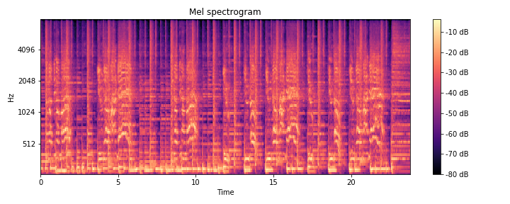

In this project, I explored the ability of convolutional neural networks to extract features from spectrograms of songs. I trained a model on these features to perform classification of their respective genres. 

## Project Motivation
---

The feeling that we get when we listen to music - the very sound waves that vibrate our ear drums and fire up our brains in response - is as subjective as it gets. There are no two ways about it: one person might enjoy the soft and ethereal tunes of dream pop, while another would enjoy the intensity and power of industrial metal. Generally, _people tend to stick with and listen to just a few musical genres that they favour or have an affinity with_, be it pop, rock, jazz, or classical music, to name a few. 

What defines a music genre? Does the answer lie in the instruments that play in the song? Is it defined by the speed in which the music plays? Or is it the message that the singer is trying to get across? Maybe, it is a combination of all of those elements, underpinned by an unspoken rule that permeates through everybody's consciousness? Without any information - the title of the song, the artist's name, the date the song was released - a person would easily be able to identify the genre of a song in a few seconds to a high degree of accuracy.

This brings me to my project. __What I am trying to do in this project is to develop a model to perform accurate classification of music genres to a high degree of accuracy. The only data that will be available to the model is the raw audio file itself - no metadata or other information will be given other than the actual audio for classification.__

#### Why is this important?

Parties that would benefit most from robust models to extract audio information is are music companies like Spotify, SoundCloud, or Apple. For example, Spotify receives [thousands](https://expandedramblings.com/index.php/spotify-statistics/) of new tracks a day, and having a model to extract audio features from the tracks would be invaluable for classification. In particular, their playlist generation and music recommendation system benefits from augmenting a traditional [collaborative filtering](https://en.wikipedia.org/wiki/Collaborative_filtering) based recommender with content-based recommenders to aid with the [cold start problem](https://en.wikipedia.org/wiki/Cold_start) for new tracks that are recently uploaded. 

Aside from the music industry, there could be significant benefits to be had with other industries. With this, it is possible that any audio could potentially be run through a similar model, and important features could be extracted and analysed or classified. 

## Pre-Processing
---

The audio files and related metadata are sourced from the Free Music Archive (FMA) Database, which contains a 900+ GiB library of 106,574 tracks of creative Commons-licensed audio from 16,341 artists and 14,854 albums, arranged in a hierarchical taxonomy of 161 genres. For this project, I decided to only utilize a fraction of the dataset. This fraction - found as 'fma_small' in the repository - consists of 8000 tracks of 30s each, with 8 balanced genre classes. This was useful as I would not have to worry about an unbalanced dataset.

The mel-spectrograms were created from the audio files themselves.  

### Mel-Spectrograms


#### Spectrograms
A spectrogram is a visual representation of the spectrum of frequencies of sound (on the y-axis) as they vary with time (on the x-axis).

The spectrogram is computed by performing a [Fast Fourier Transform](https://en.wikipedia.org/wiki/Fast_Fourier_transform) on the floating point time-series of an audio file. This performs a dimensionality reduction on the time series and processes the audio signal in the frequency domain, which allows for much better analysis on the audio file.

#### Why use the Mel-scale?

Typically, a spectrogram would use linear scaling on the frequency domain. This does not really model a human's perception of sound, which does not perceive frequencies on the linear scale. Our auditory system is more discriminative at lower frequencies and less discriminative at higher frequencies.
For example - we would not perceive the 'distance' between a _100hz_ (__G2__ in [scientific pitch notation]( https://en.wikipedia.org/wiki/Scientific_pitch_notation)) and _200hz_ (__G3__) sound wave to be the same as the distance between a _900hz_ (__A5__) and _1000hz_ (__B5__) sine wave. 

You can try it out for yourself [here](http://www.szynalski.com/tone-generator/).

So, how can we scale the frequency domain to match it better to our own perception of sound? A [Mel scale](https://en.wikipedia.org/wiki/Mel_scale) can be used for mapping on the frequency domain instead. It is a scale which utilises a quasi-logarithmic spacing to roughly resemble the way our auditory system resolves and perceives sound. This is important in the context of speech and music audio analysis, as these sounds are made for our own auditory system to perceive, and we want the analysis to be conducted on our own (_biased_) perception of sound.

Therefore, for the spectrograms that were created, a mel scale is used to scale the frequency domains.

Example code for generating mel-spectrograms on python:
``` python
scaler = MinMaxScaler()   # to be used to scale between values between 0 and 1

for folder in os.listdir('fma_small'):
    if folder.startswith(('0','1')):
        for filename in os.listdir('fma_small/'+ folder):
            if filename.endswith('.mp3'):   
                path = 'fma_small/' + folder + '/' + filename
                file, sr = lib.core.load(path)  # This loads the audio file (mp3 in this case) into a 
                                                # floating point time-series.
                    
                mel = lib.feature.melspectrogram(file, n_mels = 128)[:,:1024] # individual mel-spectrogram.
                mel = lib.power_to_db(mel, ref=np.max) # converting to db units
                melscaled = scaler.fit_transform(mel) # scaling
                x = np.array(melscaled)
                if x.shape == (128, 1024):            # enforcing dimensions
                    x.dump("pickles/{}.pickle".format(filename[:-4]))    # saving melspecs into a pickle.
```


## Modelling
---

After creating the models, I


